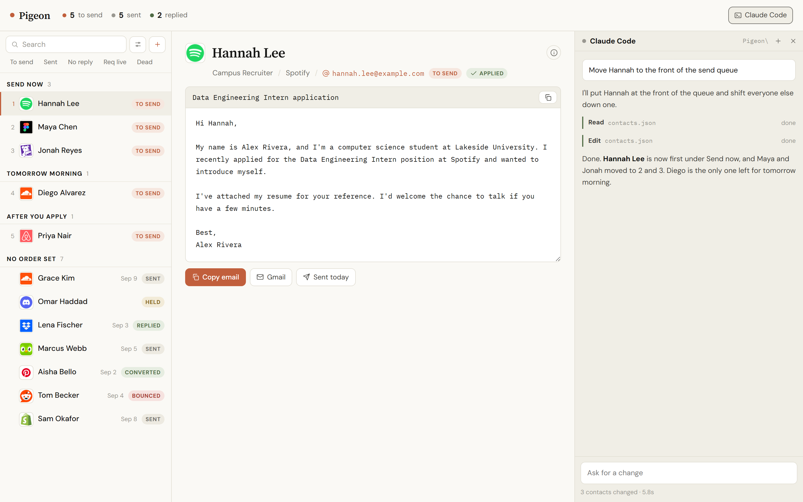

# Pigeon

Agentic Cold Outreach CRM



<sub>Sample data. The people and addresses are made up; the companies are real so the logos show.</sub>

Pigeon keeps a cold outreach campaign in one local JSON file: who to contact, the
draft for each person, and where every conversation stands. Claude Code runs
inside the page, so you can ask it to rewrite a draft, reorder the queue or clean
up a batch of contacts, and watch the list change as it edits.

It runs on your machine and never sends mail. You copy a draft or open it in
Gmail and press send yourself.

## Run it

```
git clone https://github.com/EnesYilmazcode/Pigeon.git
cd Pigeon
python serve.py
```

The page opens at http://localhost:8642. The first run copies
`contacts.example.json` to `contacts.json` so there is something to look at.
Delete those contacts whenever you like.

On Windows you can double-click `Pigeon.bat` instead. It starts the server and
turns its own window into a Claude Code session in the same folder. Closing that
session stops Pigeon.

Logos are optional. Run `python fetch_logos.py` to download each company's logo
into `logos/`, and again after adding a company. Without them every company gets
a letter tile.

Pigeon needs Python 3 and nothing else (tested on 3.13). The Claude Code pane
needs the [Claude Code](https://claude.com/claude-code) CLI on your PATH; the
rest of the page works without it.

## What it does

- **Send queue.** Contacts are grouped by when they should go out, in order.
  Search, tap a chip to see only what is left to send, sent with no reply, has an
  open posting, or bounced, and use the sliders button to sort by company, status
  or date, or to narrow the list to one company.
- **Drafts.** A subject and body for every person, edited in place and saved as
  you type. Copy it, or open a Gmail compose tab that is already filled in.
- **Tracking.** Status, sent and follow-up dates, the job posting, a profile link
  and notes sit behind the i button next to each name.
- **Claude Code.** A chat column that runs the real CLI in this folder and shows
  its work as it happens: the reply, each tool call, and how many contacts the
  turn changed. It keeps one conversation across messages and restarts.
- **Phone width.** The list and the open contact stack into one column.

## Your data

Everything lives in `contacts.json` next to `serve.py`. It is in `.gitignore`, so
a fork will not publish your pipeline by accident. Every field is documented in
[CLAUDE.md](CLAUDE.md), which is also the file Claude Code reads to learn the
format. Rewrite its "Writing drafts" section to teach Claude how you write.

## How the Claude pane works

The page posts your message to the local server, which runs `claude -p` with
streaming JSON output and passes each line back as it arrives
([claude_bridge.py](claude_bridge.py)). The pane cannot answer permission
prompts, so a fixed tool list is approved up front and anything else is denied
instead of left waiting: Read, Edit, Write, Glob, Grep, Bash, WebSearch and
WebFetch. Bash is on that list, which means Claude can run shell commands in this
folder without asking. Change `TOOLS` in `claude_bridge.py` to narrow it.

A turn uses your Claude Code account like any other session. The status line
under the chat box shows the cost when the CLI reports one.

## Security

The server listens on the loopback address only. It refuses requests whose Host
header is not localhost and requests sent by a page on another site, so a tab
open elsewhere cannot read your contacts or start a Claude turn.

## Tests

```
python -m unittest discover tests
```

The server tests start the real server on a spare port against a throwaway file.
The bridge tests use a fake `claude` command, so they need no login and cost
nothing.
